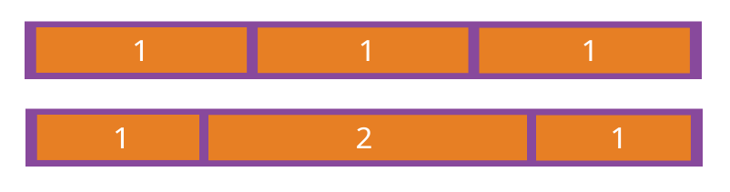

<!-- more -->

## 基本概念

采用 Flex 布局的元素，称为 Flex 容器（flex container），简称"容器"。它的所有子元素自动成为容器成员，称为 Flex 项目（flex item），简称"项目"


容器默认存在两根轴：水平的主轴（**main axis**）和垂直的交叉轴（**cross axis**）。主轴的开始位置（与边框的交叉点）叫做**main start**，结束位置叫做**main end**；交叉轴的开始位置叫做**cross start**，结束位置叫做**cross end**。

项目默认沿主轴排列。单个项目占据的主轴空间叫做**main size**，占据的交叉轴空间叫做**cross size**。

## live Demo

<flex />


## 容器的属性
  - 1. flex-direction  决定主轴的方向（即项目的排列方向）
    - row（默认值）：主轴为水平方向，起点在左端。
    - row-reverse：主轴为水平方向，起点在右端。
    - column：主轴为垂直方向，起点在上沿。
    - column-reverse：主轴为垂直方向，起点在下沿。
  
  ``` css
    .box {
      flex-direction: row | row-reverse | column | column-reverse;
    }
  ```

<flex-direction />

  - 2. flex-warp 决定项目是否换行
    - nowarp（默认值）： 不换行
    - warp： 换行，第一行在下边
    - warp-reverse： 换行，第一行在上边
  
  ``` css
    .box {
      flex-warp: nowarp | warp | warp-reverse;
    }
  ```
<flex-warp />

  - 3. flex-flow 
    flex-flow 属性是 flex-direction属性和flex-wrap属性的简写形式，默认值为row nowrap。
  ``` css
    .box {
      flex-flow: <flex-direction> || <flex-wrap>;
    }
  ```

  - 4. justify-content
    - flex-start（默认值）：左对齐
    - flex-end： 右对齐
    - center： 居中
    - space-between： 两端对齐，项目之间的间隔都相等
    - space-around： 每个项目两侧的间隔相等。所以，项目之间的间隔比项目与边框的间隔大一倍。

  ``` css
    .box {
      justify-content: flex-start | flex-end | center | space-between | space-around;
    }
  ```
<justify-content />

  - 5. align-items
    - flex-start：交叉轴的起点对齐。
    - flex-end：交叉轴的终点对齐。
    - center：交叉轴的中点对齐。
    - baseline: 项目的第一行文字的基线对齐。
    - stretch（默认值）：如果项目未设置高度或设为auto，将占满整个容器的高度。
  ``` css
    .box {
      align-items: flex-start | flex-end | center | baseline | stretch;
    }
  ```


  - 6. align-content 属性定义了多根轴线的对齐方式。如果项目只有一根轴线，该属性不起作用
    - flex-start：与交叉轴的起点对齐。
    - flex-end：与交叉轴的终点对齐。
    - center：与交叉轴的中点对齐。
    - space-between：与交叉轴两端对齐，轴线之间的间隔平均分布。
    - space-around：每根轴线两侧的间隔都相等。所以，轴线之间的间隔比轴线与边框的间隔大一倍。
    - stretch（默认值）：轴线占满整个交叉轴。
  ``` css
    .box {
      align-content: flex-start | flex-end | center | space-between | space-around | stretch;
    }
  ```


## 项目的属性
  - 1.order 数值越小，排列越靠前，默认为0。
  ``` css
    .item {
      order: <integer>;
    }
  ```


  - 2.flex-grow  定义项目的放大比例，默认为0，即如果存在剩余空间，也不放大。
  ``` css
    .item {
      flex-grow: <number>; /* default 0 */
    }
  ```


  - 3.flex-shrink 定义了项目的缩小比例，默认为1，即如果空间不足，该项目将缩小。
  ``` css
    .item {
      flex-shrink: <number>; /* default 1 */
    }
  ```

  - 4.flex-basis
  
  ``` css
  .item {
    flex-basis: <length> | auto; /* default auto */
  }
  ```
  - 5.flex 
  flex 是flex-grow, flex-shrink 和 flex-basis的简写，默认值为0 1 auto。后两个属性可选。
  
  ``` css
    .item {
      flex: none | [ <'flex-grow'> <'flex-shrink'>? || <'flex-basis'> ]
    }
  ```
  - 6.align-self
    每个子容器可以单独定义沿交叉(父容器Y)轴的排列的方式，此属性与父容器 align-items 属性完全一致，如果两者同时设置则以子容器的 align-self 属性为准。
    ``` css
      .item {
        align-self: auto | flex-start | flex-end | center | baseline | stretch;
      }
    ```


